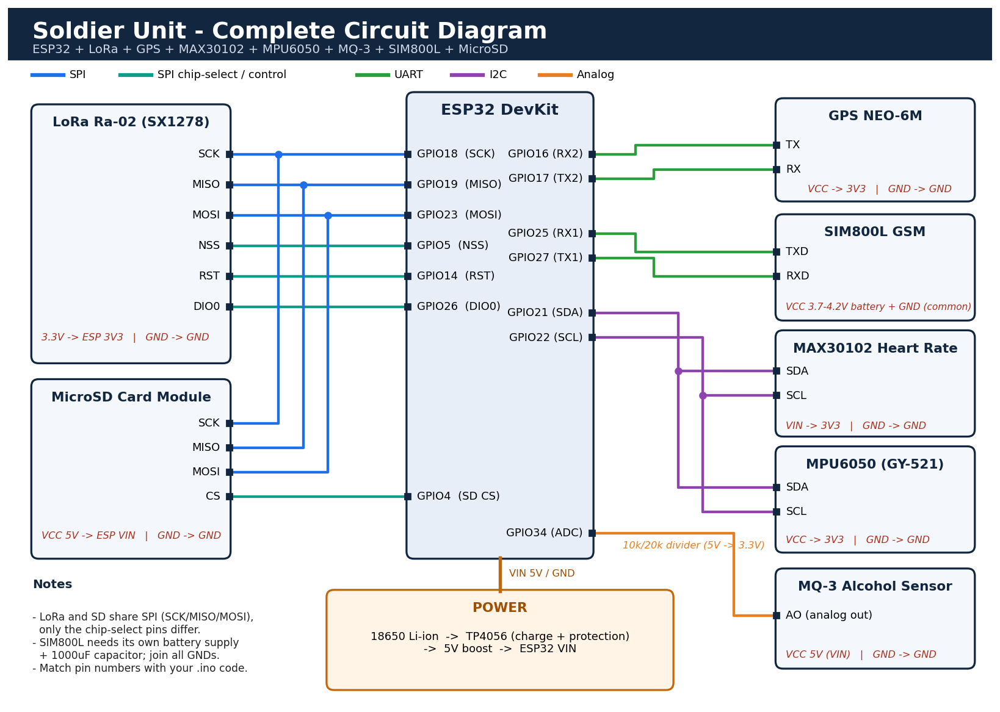

# Soldier Monitoring System Using LoRa

## 1. Project Overview
The Soldier Monitoring System Using LoRa is designed to monitor soldiers' health and location in remote and dangerous environments. The system uses ESP32 and LoRa communication to transmit information to a base station.

## 2. Objectives
- Monitor soldier location using GPS.
- Transmit data using LoRa communication.
- Monitor heart rate using a heart rate sensor.
- Provide an emergency alert using an SOS button.
- Display received information at the base station.

## 3. Hardware Components
- ESP32 Development Board
- LoRa Module (SX1278/Ra-02)
- GPS Module (NEO-6M)
- Heart Rate Sensor
- Push Button for Emergency Alert
- Jumper Wires
- Breadboard
- USB Cable
- Power Supply

## 4. Software Requirements
- Arduino IDE
- ESP32 Board Package
- TinyGPSPlus Library
- LoRa Library

## 5. Working Principle
1. The GPS module collects the soldier's location.
2. The heart rate sensor measures heart rate.
3. The ESP32 processes the sensor information.
4. The LoRa module transmits the information to the base station.
5. The receiver ESP32 receives the transmitted data.
6. An emergency message can be sent when the SOS button is pressed.

## 6. Communication
LoRa is used for long-range, low-power wireless communication between the soldier unit and the base station.

## 7. Applications
- Soldier health monitoring
- Military communication
- Emergency location tracking
- Remote personnel monitoring
- Disaster response operations

## 8. Expected Outcome
The prototype is expected to transmit soldier location and available sensor information to a base station using LoRa communication.

## 9. Safety and Limitations
This is an educational prototype. Communication range and GPS accuracy depend on the environment, antenna, and hardware configuration. Sensor readings must be tested and validated before practical use.

## 10. Future Enhancements
- SpO2 monitoring
- Mobile application integration
- Google Maps location display
- Improved emergency notification system
- Cloud-based monitoring

## 11. Project Status
Hardware integration and testing are required to verify the complete system.
## System Flowchart

## Circuit Diagram

## Block Diagram

